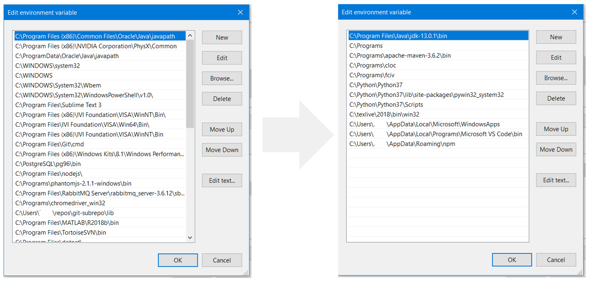

&nbsp;&nbsp;&nbsp;

## 🛁 pathtub

Simple python functions for reading and editing [Windows PATH variables](docs/path_variables.md).


   &nbsp;&nbsp;&nbsp;&nbsp;✅ **Ensuring** that an folder exists in Path. <br>
   &nbsp;&nbsp;&nbsp;&nbsp;🧽 **Cleaning** the PATH (duplicates, removed folders, sorting) <br>
   &nbsp;&nbsp;&nbsp;&nbsp;✏️ **Adding** or **removing** folders to/from Path (temporary or permanently) <br>


## Installing
```
pip install pathtub
```


## Usage

- [Ensuring folder is in PATH](#-ensuring-folder-is-in-path)
- [Cleaning PATH](#-cleaning-path)
- [Rest of the docs](#rest-of-the-docs)
  
### ✅ Ensuring folder is in PATH
- It is safe to call `ensure()` every time you load your script, for example. It only does something if the dll_folder is not found in your process `PATH`.
- The last "trailing" backslash (if any) is ignored when comparing any two folders.

```python
from pathtub import ensure
dll_folder = r'C:\my favourite\dlls'
# 1) Check Process PATH, i.e. os.environ['PATH']
# 2) Add to Process PATH (temporary) if not found
ensure(dll_folder)
```
- You may also make the addition permanent (& visible to other processes).
- Also this is safe to call every time script is starting. 
```python
from pathtub import ensure
dll_folder = r'C:\my favourite\dlls'
# 1) Check Process PATH
# 2) Add to Process PATH if not found
# 3) Add also to User PATH (permanent), if 2) happens
ensure(dll_folder, permanent=True)
```
- The Process PATH is loaded from parent process or from the permanent (User/System) PATH when process is started. For more info, see: [Windows PATH variables](docs/path_variables.md).
- ["Real life" example using ensure](docs/example_ensure.md).
- Full documentation of `ensure()` is in the source code ([pathtools.py](pathtub/pathtools.py)).
### 🧽 Cleaning PATH
#### Cleaning paths means
1. Removing duplicates from the PATH (trailing backslash neglected)
2. Removing empty entries from PATH
3. Sorting alphabetically (optional, Default: True)
4. Removing folders that do not exist (optional, Default: True)
5. Removing from "User" list the ones that are in the "System" list (optional, default: True)

#### Screenshots of User PATH before and after clean:
     

#### Code example for clean
```
from pathtub import clean
clean()

# possible parameters:
# clean(sort=True, remove_non_existent=True, remove_user_duplicates=True)
```
- For more detailed example, see [Full example of pathtub.clean](docs/example_clean.md)
- Full documentation of `clean()` is in the source code ([pathtools.py](pathtub/pathtools.py)).

### Rest of the docs
Did not find what you were looking for? See the [Rest of the docs](docs/rest_of_the_docs.md).
