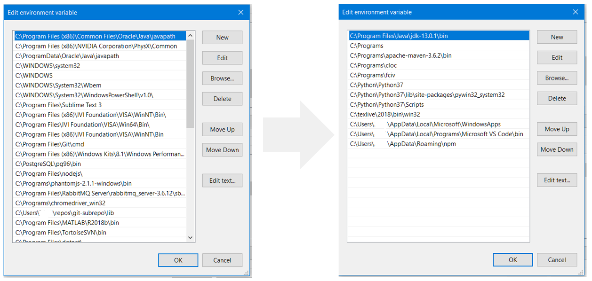

## Full example of `pathtub.clean`

- Running the code below two times: <br>
&nbsp;&nbsp;&nbsp;&nbsp;&nbsp;&nbsp;**Run #1**: ⛔👮 Without admin rights 👉 Only edit **User PATH**<br>
&nbsp;&nbsp;&nbsp;&nbsp;&nbsp;&nbsp;**Run #2**: ✅👮 With admin rights 👉 Also edit **System PATH**

```python
from pathtub import clean
clean()
```

<details><summary>Output from Run #1 (⛔👮 Without admin rights)</summary>
<p>

```
Removing folder C:\Program Files\Sublime Text 3 from User Path (non-existing)
Removing folder C:\Programs\phantomjs-2.1.1-windows\bin from User Path (non-existing)
Removing folder C:\Programs\chromedriver_win32 from User Path (non-existing)
Removing folder C:\Program Files (x86)\Microsoft SQL Server\150\DTS\Binn from User Path (non-existing)
Removing folder C:\Python\Python37-32\Scripts from User Path (non-existing)
Removing folder C:\Python\Python37-32 from User Path (non-existing)
Removing folder C:\Program Files\Microsoft VS Code\bin from User Path (non-existing)
Removing folder C:\Program Files\Sublime Text 3 from System Path (non-existing)
Removing folder C:\Programs\phantomjs-2.1.1-windows\bin from System Path (non-existing)
Removing folder C:\Programs\chromedriver_win32 from System Path (non-existing)
Removing folder C:\Program Files (x86)\Microsoft SQL Server\150\DTS\Binn from System Path (non-existing)
Removing folder C:\Program Files (x86)\Common Files\Oracle\Java\javapath from User Path (Defined in both; User and System PATH)
Removing folder C:\Program Files (x86)\NVIDIA Corporation\PhysX\Common from User Path (Defined in both; User and System PATH)
Removing folder C:\ProgramData\Oracle\Java\javapath from User Path (Defined in both; User and System PATH)
Removing folder C:\WINDOWS\system32 from User Path (Defined in both; User and System PATH)
Removing folder C:\WINDOWS from User Path (Defined in both; User and System PATH)
Removing folder C:\WINDOWS\System32\Wbem from User Path (Defined in both; User and System PATH)
Removing folder C:\WINDOWS\System32\WindowsPowerShell\v1.0 from User Path (Defined in both; User and System PATH)
Removing folder C:\Program Files (x86)\IVI Foundation\VISA\WinNT\Bin from User Path (Defined in both; User and System PATH)
Removing folder C:\Program Files\IVI Foundation\VISA\Win64\Bin from User Path (Defined in both; User and System PATH)
Removing folder C:\Program Files\Git\cmd from User Path (Defined in both; User and System PATH)
Removing folder C:\Program Files (x86)\Windows Kits\8.1\Windows Performance Toolkit from User Path (Defined in both; User and System PATH)
Removing folder C:\PostgreSQL\pg96\bin from User Path (Defined in both; User and System PATH)
Removing folder C:\Program Files\nodejs from User Path (Defined in both; User and System PATH)
Removing folder C:\Program Files\RabbitMQ Server\rabbitmq_server-3.6.12\sbin from User Path (Defined in both; User and System PATH)
Removing folder C:\Users\USER\repos\git-subrepo\lib from User Path (Defined in both; User and System PATH)
Removing folder C:\Program Files\MATLAB\R2018b\bin from User Path (Defined in both; User and System PATH)
Removing folder C:\Program Files\TortoiseSVN\bin from User Path (Defined in both; User and System PATH)
Removing folder C:\Program Files\dotnet from User Path (Defined in both; User and System PATH)
Removing folder C:\Program Files (x86)\PuTTY from User Path (Defined in both; User and System PATH)
Removing folder C:\WINDOWS\System32\OpenSSH from User Path (Defined in both; User and System PATH)
Removing folder C:\Program Files\Intel\WiFi\bin from User Path (Defined in both; User and System PATH)
Removing folder C:\Program Files\Common Files\Intel\WirelessCommon from User Path (Defined in both; User and System PATH)
Removing folder C:\Program Files\CrashPlan\jre\bin\server from User Path (Defined in both; User and System PATH)
Removing folder C:\Program Files\CrashPlan\jre\bin from User Path (Defined in both; User and System PATH)
Could not clean the SYSTEM PATH! Needs Admin rights!

```
</p>
</details>

<details><summary>Output from Run #2 (✅👮 With admin rights)</summary>
<p>

```
Removing folder C:\Program Files\Sublime Text 3 from System Path (non-existing)
Removing folder C:\Programs\phantomjs-2.1.1-windows\bin from System Path (non-existing)
Removing folder C:\Programs\chromedriver_win32 from System Path (non-existing)
Removing folder C:\Program Files (x86)\Microsoft SQL Server\150\DTS\Binn from System Path (non-existing)
```
</p>
</details>
<br>

- Screenshots of User PATH before and after clean:
     
- Screenshots of System PATH before and after clean (with admin rights):
  